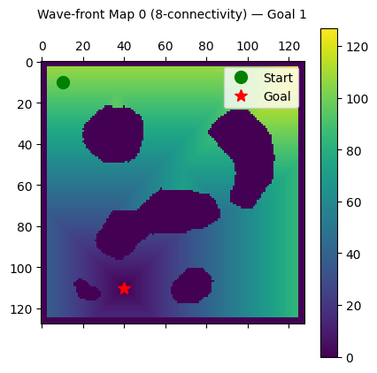

# Grid-Based Path Planning: Potential Fields vs Wavefront Planner

## Overview
This repository implements and evaluates two foundational 2D grid-based motion planning algorithms: **Harmonic Potential Fields** and the **Wavefront Planner**. Written entirely in Python, the project extracts optimal trajectories by treating the robot as a particle navigating a custom physical potential landscape comprising attractive forces (the goal) and short-range repulsive boundaries (obstacles). Furthermore, it provides a comparative mathematical analysis detailing the local minima vulnerabilities inherent in continuous gradient descent versus the globally optimal convergence guarantees provided by topological Wavefront distance transforms.

## Algorithms Implemented

The implementation is modularized in the `src/` directory and includes:

1. **Attractive & Repulsive Potential Fields:** Quadratic potentials formulated around custom distance metrics (Euclidean, Manhattan).
2. **Brushfire Distance Transform:** A breadth-first expansion algorithm to map distances to the nearest obstacle space.
3. **Discrete Gradient Descent:** Iterative path generation traversing the negative gradient of the total potential function.
4. **Wavefront Planner:** A global distance-to-goal transform establishing a navigation function completely free of localized sub-optima.
5. **Greedy Grid Descent:** A deterministic path extraction approach applied synchronously over the evaluated wavefront layer.

## Experimental Evaluation

The motion planning algorithms are tested on four distinct 2D occupancy grid maps (`map0` - `map3`), designed to introduce challenges like tight corridors, symmetric traps, and long-range traversal. 

### Performance Testing Scope
* **Connectivity Comparison:** Evaluating directional path resolution constraints between 4-connectivity and 8-connectivity.
* **Local Minima Failure Cases:** Observing scenarios where ∇U(q) = 0 before the target configuration is reached under the standard harmonic potential field.
* **Wavefront Robustness:** Validation of global topological convergence regardless of starting configuration constraints.

<p align="center">
  
  
</p>

## Key Insights

* **Potential fields suffer from local minima:** Complex topographies inherently trap iterative descent behaviors due to symmetrical multi-directional repulsive forces neutralizing attractive gradients.
* **Connectivity influences motion resolution:** Switching from 4-connected discrete grids to 8-connected significantly increases path smoothness and reduces suboptimal sharp maneuvers.
* **Wavefront guarantees convergence:** By designing the distance transform explicitly from the goal position outward as a wave, all free configurations possess a strictly monotonically decreasing sequence leading to the destination.
* **Global vs local optimization trade-offs:** Potential fields scale excellently and naturally handle continuous domain translations but fail globally. Wavefront planning succeeds globally but involves heavy BFS iterations across discretely constrained grid configurations.

## How to Run

1. Clone the repository and install requirements:
```bash
pip install -r requirements.txt
```

2. Run the main evaluation pipeline:
```bash
python src/main.py
```

This will run all tests, generate paths, output performance metrics in `results/performance_summary.txt`, and save visual plots in `report/result_images/`.

Alternatively, use the provided Jupyter Notebook in `notebooks/` for interactive analysis.

## Dependencies

- `numpy`
- `matplotlib`
- `Pillow`

## Applications

Classical path-planning knowledge like this establishes the foundations employed throughout modern robotics:
* Mobile robot local navigation
* Global occupancy grid planning
* Autonomous exploration algorithms
* SLAM (Simultaneous Localization and Mapping) post-processing workflows
