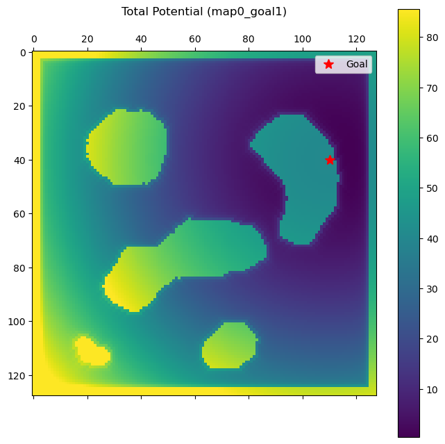
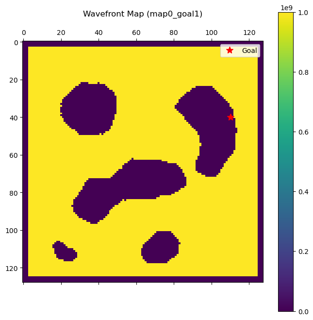
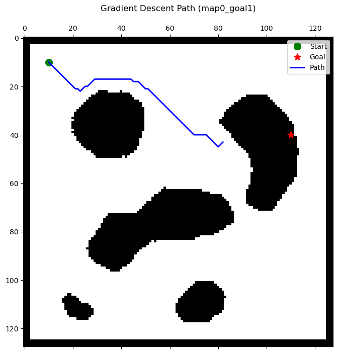
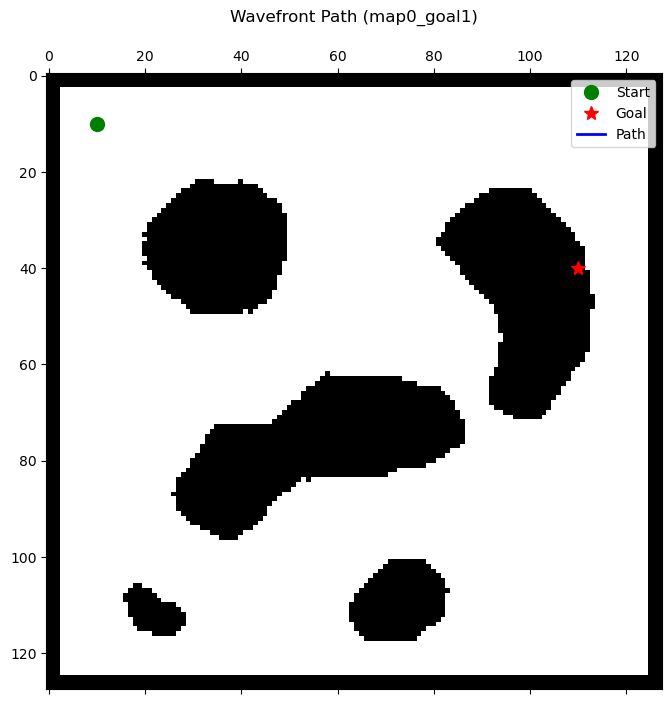

# Grid-Based Motion Planning

## 1. Introduction
Robot motion planning requires determining a collision-free path from a starting configuration to a goal configuration within an environment sparsely or densely populated with obstacles. This report investigates grid-based motion planning via two foundational techniques: **Harmonic Potential Fields** and the **Wavefront Planner**. The focus is placed on continuous navigation in discrete space, evaluating distance metrics, connectivity rules, and algorithmic completeness.

## 2. Mathematical Formulation of Potential Fields

The potential field methodology conceptually treats the robot as a particle moving under the influence of an artificial energy field $U(q)$. The landscape is constructed such that the goal location behaves as a global minimum, exerting an attractive force on the robot, while obstacles act as high-energy peaks, exerting a short-range repulsive force. 

The path is extracted by guiding the robot along the negative gradient $-\nabla U(q)$ of the total potential field.

### 2.1 Attractive Potential Field ($U_{att}$)
The attractive potential field pulls the robot towards the target destination $q_{goal}$. We employ a quadratic formulation to ensure the attractive force diminishes gracefully as the robot approaches the destination, preventing severe overshoot oscillations.

$U_{att}(q) = \frac{1}{2} \xi d(q, q_{goal})^2$

Where:
* $\xi$ is a strictly positive scaling factor dictating the strength of the attraction.
* $d(q, q_{goal})$ is the spatial distance metric between the robot's current configuration $q$ and the goal $q_{goal}$.

Three metrics for $d$ were evaluated:
1. **Euclidean Distance:** $d = \sqrt{(x - x_{goal})^2 + (y - y_{goal})^2}$
2. **Manhattan Distance:** $d = |x - x_{goal}| + |y - y_{goal}|$
3. **Grid Topological Distance (BFS):** True path traversal counts considering obstacle geometries and 4-/8-connectivity constraints.

### 2.2 Repulsive Potential Field ($U_{rep}$)
To prevent the robot from colliding with the physical environment, a repulsive potential acts as a localized repelling barrier. It strictly influences the robot when it falls within a critical defined threshold distance $Q$.

$U_{rep}(q) = \begin{cases} \frac{1}{2} \eta \left( \frac{1}{D(q)} - \frac{1}{Q} \right)^2 & \text{if } D(q) \leq Q \\ 0 & \text{if } D(q) > Q \end{cases}$

Where:
* $\eta$ is a positive repulsive scaling factor.
* $D(q)$ is the clearance distance from configuration $q$ to the nearest obstacle.
* $Q$ is the influence radius (threshold) of the obstacles.

This equation guarantees that as the robot approaches an obstacle boundary ($D(q) \to 0$), the repulsive potential strictly approaches infinity, forming an impenetrable barrier.

### 2.3 Total Potential Field
By linear superposition, the total field is obtained by superimposing the independent attractive and repulsive landscapes:

$U_{total}(q) = U_{att}(q) + U_{rep}(q)$

The control input to the kinematic robot is thus defined to follow the steepest descent of this summed scalar field.

## 3. Distance Transform (Brushfire Algorithm)

The parameter $D(q)$, representing the distance to the nearest obstacle, cannot be computed naively without immense computational overhead for complex maps. Grid propagation techniques, specifically the brushfire algorithm, establish the obstacle proximity function efficiently.

By initializing all obstacle coordinates in a queue and evaluating an outward-expanding breadth-first search (BFS), the algorithm progressively cascades across free space determining the shortest path to an obstacle boundary. The use of discrete cell updates guarantees accurate $O(N)$ completion where $N$ represents total grid cells.

## 4. Discrete Gradient Descent

Once the total potential landscape is formulated, path extraction follows discrete gradient descent rules. For an occupancy cell at location $(i, j)$ with valid movement configurations defined by connectivity $C$ (where $C \in \{4, 8\}$), the path iterative process performs:

$q_{k+1} = \text{argmin}_{q' \in neighbor(q_k)} \quad U_{total}(q')$

The robot greedily evaluates all adjacent spatial connections, shifting to the neighbor exhibiting the lowest local potential magnitude.

## 5. Wavefront Planning

To overcome the inherent pathological local minima issues within pure harmonic potential fields, the Wavefront Planner constructs a modified topographical landscape guaranteeing global completeness—meaning it successfully finds a path if one exists.

Starting exclusively from $q_{goal}$ assigned a value of 0, expanding contour waves progressively permeate the entire accessible map space. An untraversed cell $x_{val}$ updates its internal state incrementally based on neighboring depth values:

$Depth(x_{t+1}) = 1 + \min \limits_{n \in N(x)} \{ Depth(n) \}$

Once the wave propagation comprehensively covers the $q_{start}$ location, simple deterministic greedy descent extracts the guaranteed path by continually following decreasing values to 0.

## 6. Connectivity Analysis (4-Connected vs. 8-Connected)

The movement kinematics within grid-based environments define permissible exploration vectors.

* **4-Connectivity:** Allows translational movements restricted to cardinal directions (Up, Down, Left, Right). This formulation frequently introduces sharp Manhattan-like zig-zag maneuvers over long Euclidean paths.
* **8-Connectivity:** Integrates diagonal neighbor accessibility. Trajectories naturally become smoother and closely resemble realistic non-holonomic kinematic curve motions compared to strictly orthogonal translations. 

8-connectivity significantly minimizes the artificial distance estimation artifacts present strictly on discretized arrays.

## 7. Experimental Results

Visualizations acquired over various complex structural domains (`map0` – `map3`) highlighted strong theoretical consistencies.

**Total Potential Field Example:**

*(Displays intense repulsive spikes surrounding obstacles, with a global slope oriented toward the destination.)*

**Wavefront Map Example:**

*(Displays concentric distance contours uniformly expanding out from the destination point ensuring no local basins arise.)*

**Gradient Descent vs Wavefront Extracted Trajectories:**

*(Comparative behavior of potential-induced movement vs globally optimal monotonic paths.)*

## 8. Failure Analysis (Local Minima)

Potential Fields are fundamentally susceptible to local minima failures. In scenarios featuring symmetric U-shaped or concave obstacles positioned obstructing the direct Euclidean path toward the goal, the repulsive force strictly counterbalances the attractive force.

$\nabla U_{att}(q) + \nabla U_{rep}(q) = \vec{0}$

When establishing a net-zero force gradient before reaching $q_{goal}$, the robot becomes trapped in an oscillating deadlock state, requiring external heuristic interventions (such as random walk disturbances or boundary-following routines) to permanently escape. This failure was repeatedly observable upon configurations featuring `map0` with $goal_2$ isolated partially within a wall obstruction.

## 9. Comparative Evaluation

| Algorithm | Algorithm Completeness | Optimality | Computational Cost | Local Minima |
| :--- | :--- | :--- | :--- | :--- |
| **Potential Field** | No | Gradient-dependent | Very Low | Highly susceptible |
| **Wavefront Planner** | Yes (Global) | Distance Optimal | High (Full BFS map sweep) | Immune |

## 10. Conclusion

The classical Potential Field serves as a highly robust, computationally inexpensive formulation permitting smooth localized reactive guidance suitable for highly dynamic environments. However, complete planning in complex grid architectures mandates global visibility. Integrating BFS-driven topographical transforms such as the Wavefront Planner circumvents catastrophic gradient stasis, establishing a firm mathematical foundation guaranteeing safe, globally efficient robot path navigation.
